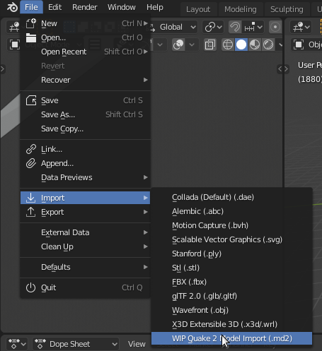
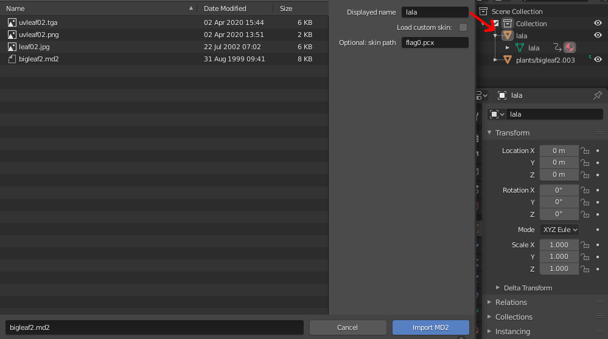
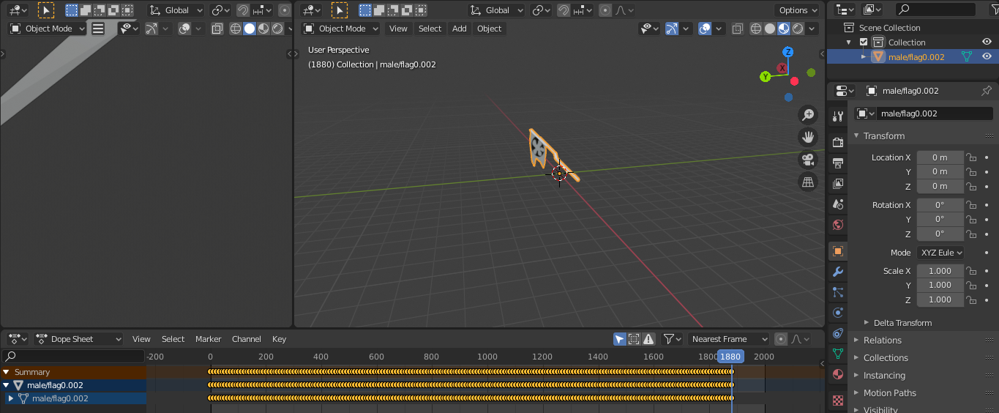
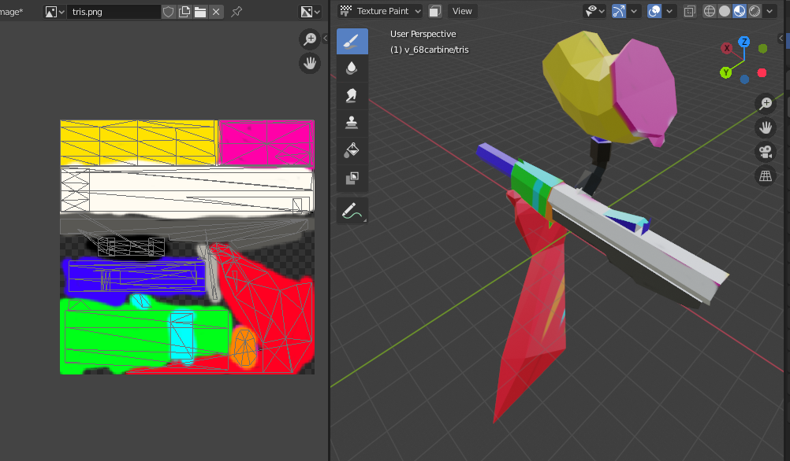

# Quake 2 MD2 import add-on for Blender 3.x
This add-on allows importing .md2 model files. This hasn't been
natively supported by [Blender](https://www.blender.org/) for
a decade now.

Please note that this add-on is still incomplete. **Bug reports and feature
requests are welcome!**

Developed and tested with Blender 3.6.5 and Python 3.10.13.
Older versions might still (partially) work.

## What can this importer (!) do so far?

- load an MD2 object to Blender
- attach a UV map linked in the .md2 file or a custom one
  - Blender native formats (not verified except .jpg):
  - custom format: .pcx
- load and run keyframe animations

### Blender native image formats in Blender 3.6.5 / Python 3.10.13:
```python3
>>> bpy.path.extensions_image
frozenset({'.tx', '.png', '.cin', '.tiff', '.bmp', '.rgb', '.tga', '.sgi', '.jpeg', '.dpx', '.psd', '.jp2', '.j2c', '.hdr', '.webp', '.rgba', '.exr', '.pdd', '.jpg', '.psb', '.dds', '.tif'})
```
## What is missing?

- aligning the animation keyframes to the fps used for the different animations

## [Releases](https://github.com/lennart-g/blender-md2-importer/releases)

## Installation
Install the provided .zip via the Edit > Preferences > Add-ons menu.

### Optional: PCX skin files
When loading a .pcx file, a message referring to this README is shown.

1. [install Pillow (used for loading .pcx files)](https://blender.stackexchange.com/a/122337). 
Replace `pip install scipy` with `pip install pillow`.
On old Blender / Python versions, an upgrade of pip might be necessary.
2. Check the plugin activation checkbox again.

## Development
Follow [these instructions](https://github.com/lennart-g/bsp_hacking/blob/master/docs/blender_importer.md)
with adjustments for this repository.

## How to use

The script can be accessed via File > Import:



Checking "Load custom skin" allows loading a UV map different
from the one specified in the .md2 file. By entering a
"displayed name" the object and mesh name in the outliner
is specified.



Model keyframes are loaded with 9 empty frames in between
and displayed in the dope sheet.



In the UV editor you can see both the UV map and
the UV layout.


Using texture paint mode, this allows easily editing
and adding new UV maps. The current importer does not
support exporting a modified UV layout though.


